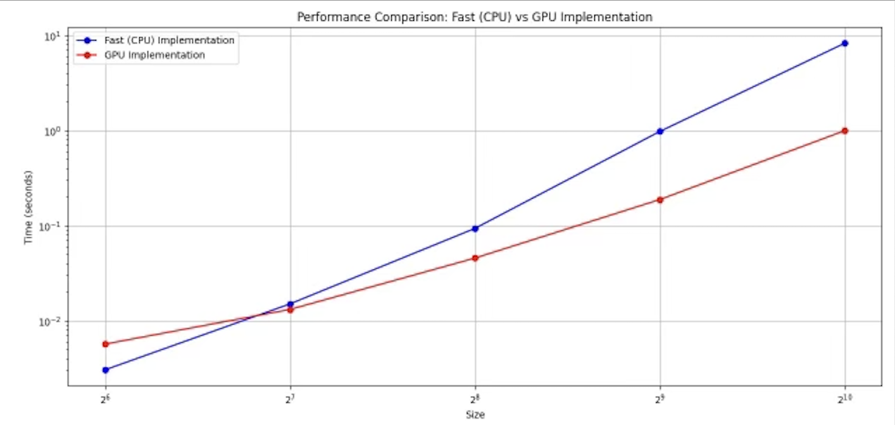

# MiniTorch Module 3


* Docs: https://minitorch.github.io/

* Overview: https://minitorch.github.io/module3.html

You will need to modify `tensor_functions.py` slightly in this assignment.

* Tests:

```
python run_tests.py
```

* Note:

Several of the tests for this assignment will only run if you are on a GPU machine and will not
run on GitHub's test infrastructure. Please follow the instructions to set up a Colab machine
to run these tests.

This assignment requires the following files from the previous assignments. You can get these by running

```bash
python sync_previous_module.py previous-module-dir current-module-dir
```

The files that will be synced are:

```
minitorch/tensor_data.py minitorch/tensor_functions.py minitorch/tensor_ops.py minitorch/operators.py minitorch/scalar.py minitorch/scalar_functions.py minitorch/module.py minitorch/autodiff.py minitorch/module.py project/run_manual.py project/run_scalar.py project/run_tensor.py minitorch/operators.py minitorch/module.py minitorch/autodiff.py minitorch/tensor.py minitorch/datasets.py minitorch/testing.py minitorch/optim.py
```

---

## Results and Log Files

The following table describes the files located in the `results` directory:

| **File Name**             | **Description**                                                              | **Path**                                                                                          |
|---------------------------|------------------------------------------------------------------------------|--------------------------------------------------------------------------------------------------|
| `simple_log_cpu.txt`      | Log file for basic operations executed on the CPU.                         | `minitorch/results/simple_log_cpu.txt`                                                          |
| `simple_log_gpu.txt`      | Log file for basic operations executed on the GPU.                         | `minitorch/results/simple_log_gpu.txt`                                                          |
| `xor_log_cpu.txt`         | Log file for XOR operations executed on the CPU.                           | `minitorch/results/xor_log_cpu.txt`                                                             |
| `xor_log_gpu.txt`         | Log file for XOR operations executed on the GPU.                           | `minitorch/results/xor_log_gpu.txt`                                                             |
| `split_log_gpu.txt`       | Log file for split operations executed on the GPU.                         | `minitorch/results/split_log_gpu.txt`                                                           |                                                  |
| `big_simple_log_cpu.txt`  | Log file for large-scale simple operations executed on the CPU.             | `minitorch/results/big_simple_log_cpu.txt`                                                      |
| `big_simple_log_gpu.txt`  | Log file for large-scale simple operations executed on the GPU.             | `minitorch/results/big_simple_log_gpu.txt`                                                      |
| `matmul_result.png`       | Visualization of the matrix multiplication result.                         | `minitorch/results/matmul_result.png`                                                           |

---

### Visualization

#### Matrix Multiplication Result
Below is the visualization for matrix multiplication:



---

### Notes

- The log files help analyze performance on CPU and GPU for various operations.
- The `matmul_result.png` provides a visual representation of the results from matrix multiplication.
- These files are generated as part of the MiniTorch computations.
